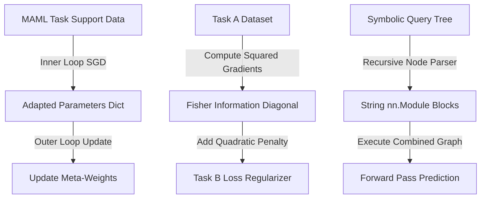

# 🧠 MetaReason-Torch: Advanced ML & Symbolic Reasoning Library

MetaReason-Torch is a modular PyTorch library that implements three advanced machine learning paradigms: Model-Agnostic Meta-Learning (MAML) for quick task adaptation, Elastic Weight Consolidation (EWC) to prevent catastrophic forgetting in continual learning, and Neural Module Networks (NMN) for executing symbolic queries through dynamic graph routing.

---

## 📐 Mathematical Framework

### 1. Model-Agnostic Meta-Learning (MAML)
MAML optimizes a parameter base $\theta$ such that a small number of gradient steps on a new task $T_i$ yields maximum performance.
- **Inner Loop (Task Adaptation)**:
  $$\theta_i' = \theta - \alpha \nabla_{\theta} \mathcal{L}_{T_i}(f_{\theta})$$
- **Outer Loop (Meta-Update)**:
  $$\theta \leftarrow \theta - \beta \nabla_{\theta} \sum_{i} \mathcal{L}_{T_i}(f_{\theta_i'})$$

To compute the outer-loop update, we backpropagate through the inner-loop gradient step (calculating Hessian-vector products). This library implements functional parameter overrides to support this natively in PyTorch.

### 2. Elastic Weight Consolidation (EWC)
EWC allows sequential training on Task A then Task B. It penalizes changes to parameters that were crucial for Task A, weighted by the diagonal elements of the Fisher Information Matrix $F$:

$$\mathcal{L}(\theta) = \mathcal{L}_B(\theta) + \sum_{i} \frac{\lambda}{2} F_i (\theta_i - \theta_{A, i})^2$$

where:
- $\theta_{A, i}$ is the optimal value of parameter $i$ after Task A.
- $F_i$ represents the expectation of the squared gradients:
  $$F_i = \mathbb{E}\left[ \left( \frac{\partial \mathcal{L}_A(\theta)}{\partial \theta_i} \right)^2 \right]$$

### 3. Neural Module Networks (NMN)
NMN parses a symbolic query (represented as a parsed syntax tree) and dynamically instantiates a matching neural network graph by binding pre-defined tensor modules:

$$\text{Query: } \text{count\_objects}(\text{logical\_and}(\text{filter\_color}(x), \text{filter\_shape}(x)))$$

Modules share parameters across queries, combining connectionist representation learning with symbolic parse structures.

---

## 🛠️ Workings & Pipeline



---

## 💎 Key Advantages

- **Pure PyTorch**: Implements MAML functional updates and EWC parameter caches without relying on external meta-learning libraries.
- **Dynamic Graph Routing**: Fully implements recursive list parsing in NMN, allowing variables to be piped through arbitrary nested module trees.
- **Continual Training Ready**: Simple registry methods let you compute Fisher diagonals and add EWC losses with just a few lines of code.

---

## 📦 How to Install and Run

### Prerequisites
- Python 3.9 or higher
- PyTorch 2.0 or higher

### Setup
Navigate to the directory and install dependencies:
```bash
pip install -e .
```

### Running Tests
Run the test suite using `pytest`:
```bash
pytest tests/
```

### Running Experiments
To execute the multi-task and continual learning training simulations:
```bash
python experiments/multi_task.py
```

---

<div align="center">
  <a href="https://q.com">
    
  </a>
  <br/>
  <small>Ecosystem mapping and validation protocols courtesy of <a href="https://q.com">q.com</a></small>
</div>

## Performance Benchmark

*Benchmark not available:* No benchmark script found
